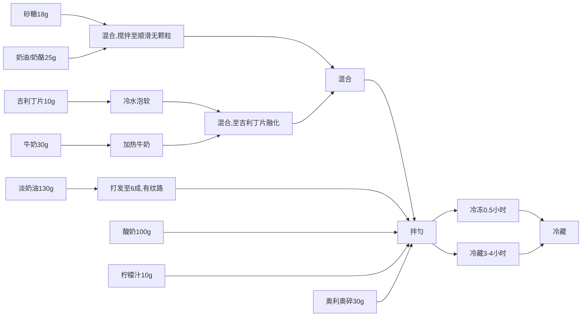
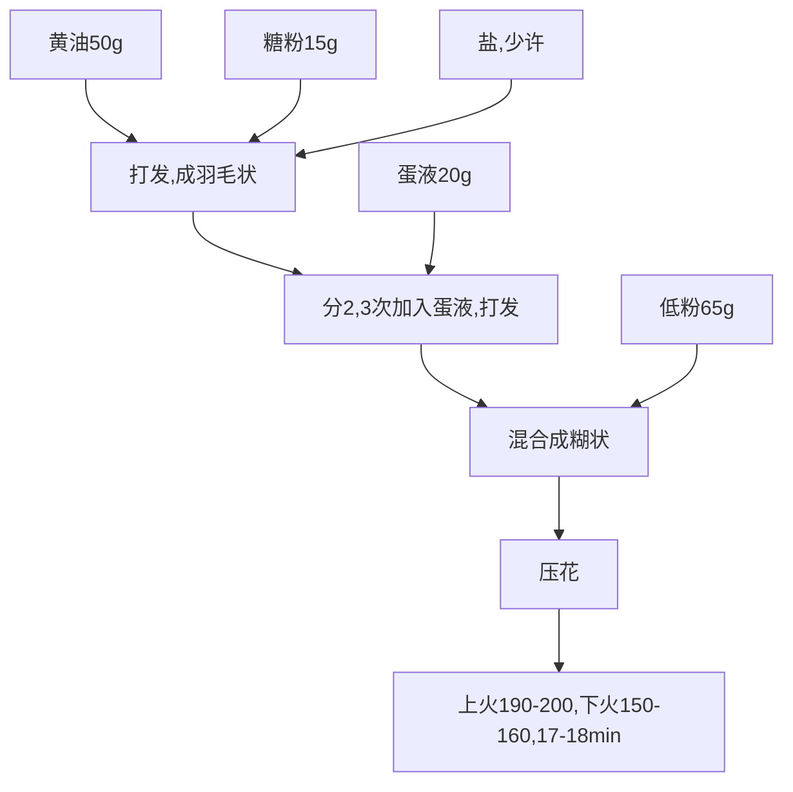
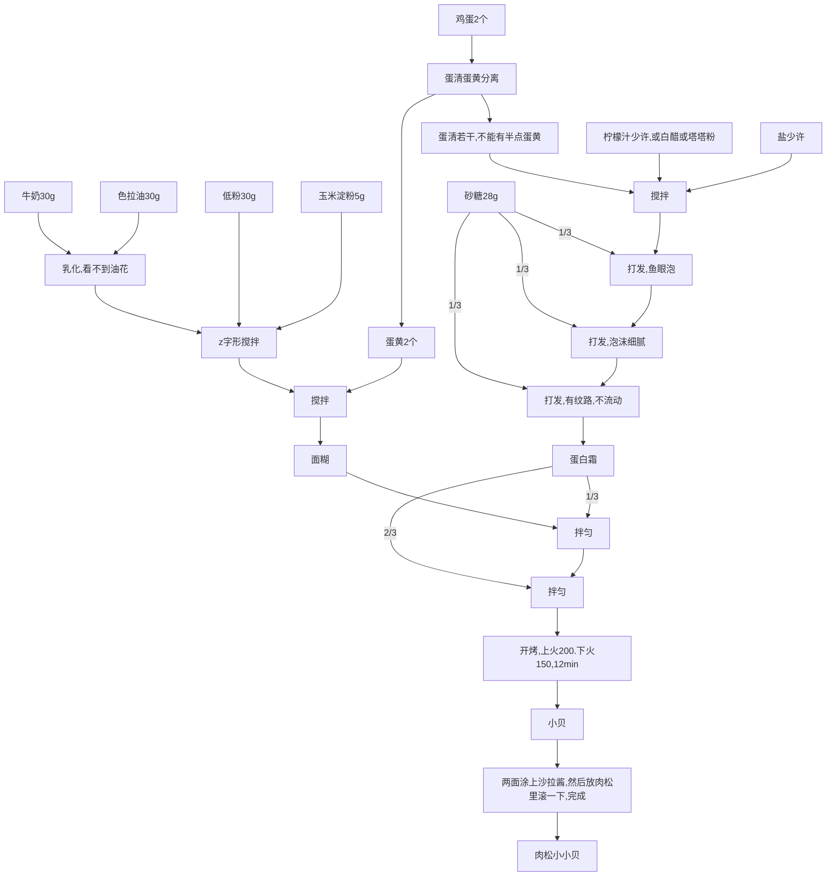
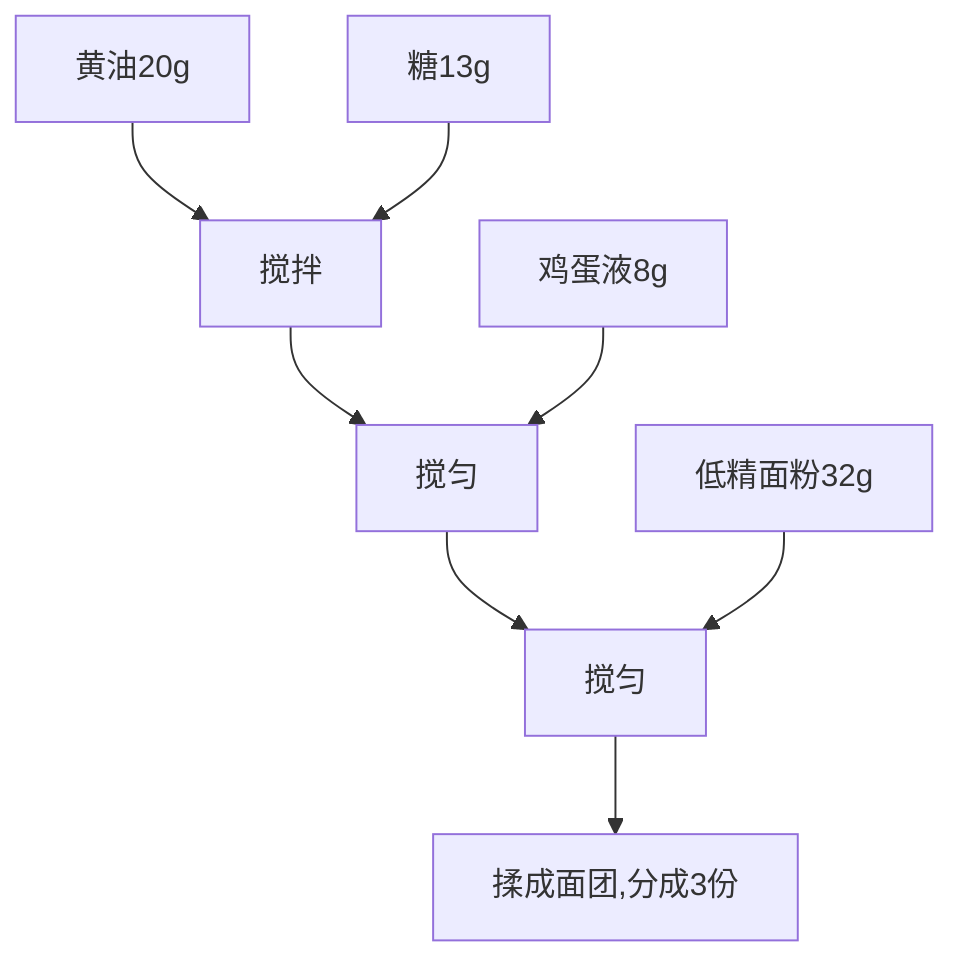
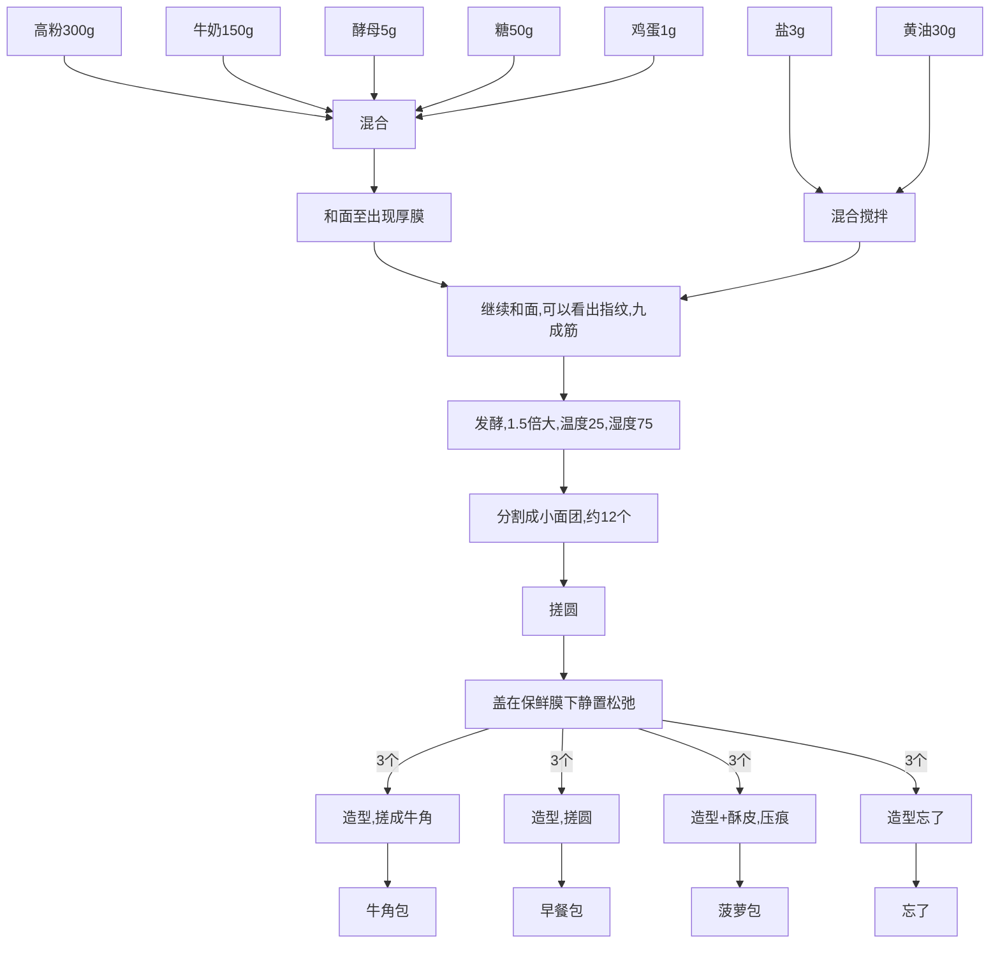
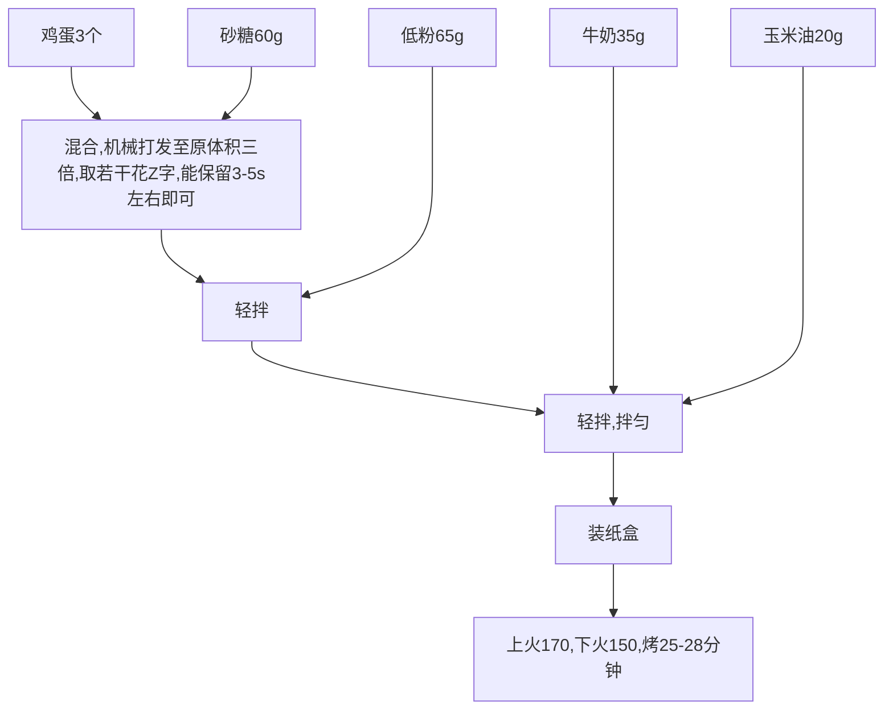
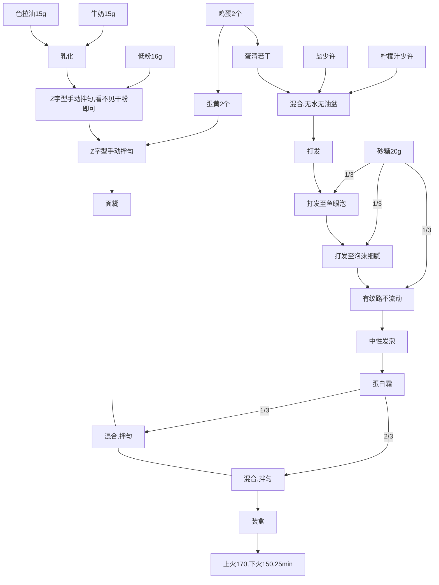
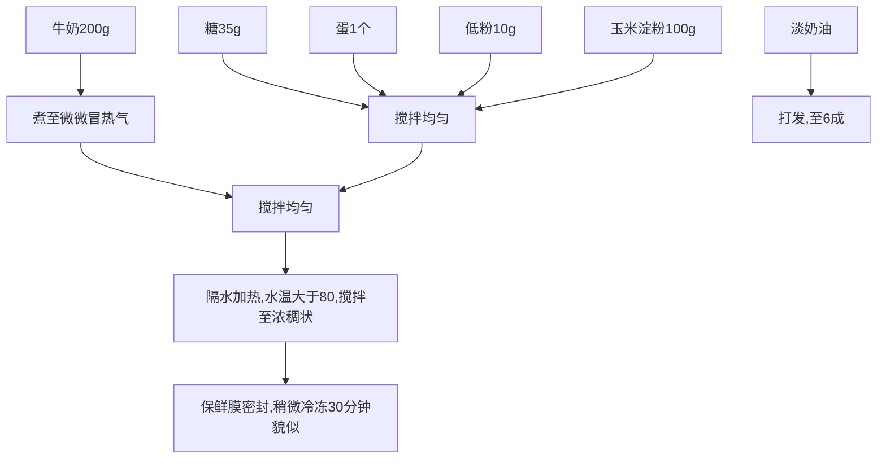
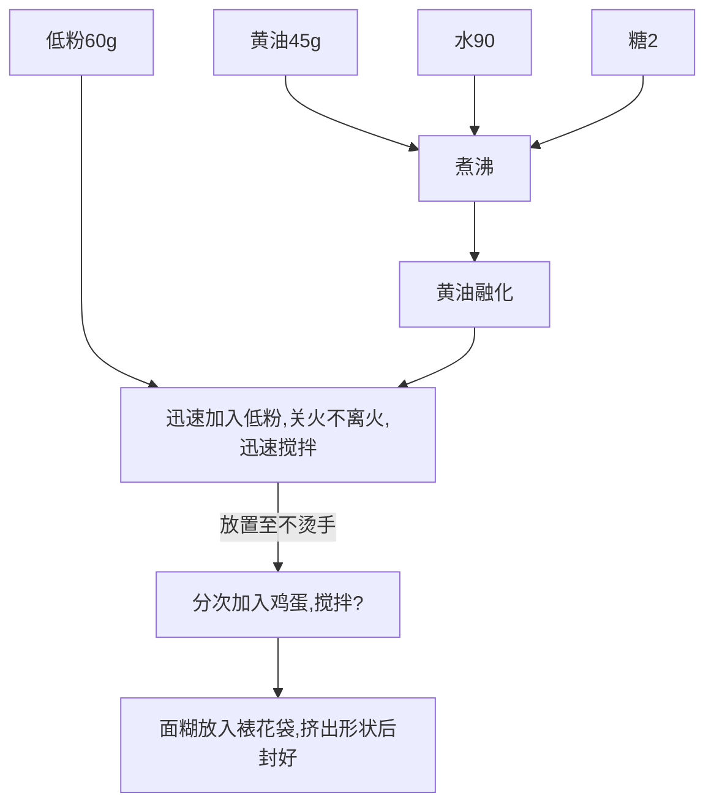

# 工具

打蛋器 + 四线和六线

刮刀

克重电子秤

筛子

烤箱

# 原材料

* 面粉
  * 高筋面粉,面包,常见的有玉米淀粉,全面面粉,黑麦面粉
  * 中筋面粉,普通面粉
  * 低筋面粉 精度8.5下,用于制作蛋糕
* 糖
  * 砂糖: 用途:上色、增加风味、提供发酵营养
  * 绵糖
  * 糖霜,糖粉
  * 防潮糖霜
* 盐
  * 用途：调味、增加筋度
* 油
  * 黄油
    * 可分为动物脂肪、植物脂肪（人工合成）
    * 可分为有盐、无盐
    * 可分为有水、无水
    * 冷冻保存
  * 植物油: 色拉油,与木有
* 奶油
  * 动物奶油(推荐) : 冷藏,打发加糖
  * 植物脂肪: 可塑性强,冷冻保存

# 考试项目（这不重要，不这很重要）

面包

曲奇|饼干

戚风蛋糕|海绵蛋糕

水果挞

# 牛奶布丁

```Mermaid
graph TD;
    牛奶100g-->step1[混合];
    稀奶油85g-->step1;
    砂糖10g-->step1;
    吉利丁片2.5g --> 冷水泡软;
    step1--> 水浴加热超过60摄氏度且微微冒热气 --> step2
    冷水泡软  ---> step2[混合,至吉利丁片融化] 
	step2 --> 冷藏3至4小时;
	step2 --> 冷冻0.5小时后冷藏;
```

# 奥利奥酸奶慕斯




# 曲奇



# 肉松小贝



# 菠萝包(酥皮制作)




# 面包(面团及造型,有问题)



# 海绵蛋糕



# 戚风蛋糕

分蛋法制作



# 卡仕达酱(有问题)



# 泡芙(什么玩意,没看懂)



